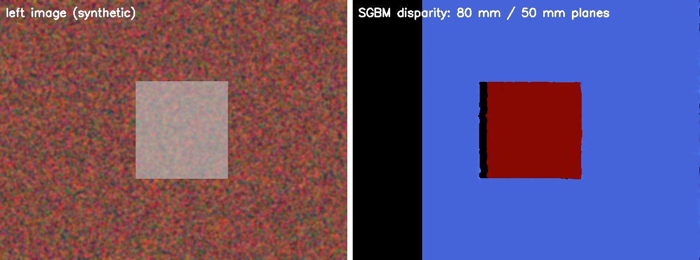

# Surgical Scene CV

**Deep-learning segmentation and stereo depth estimation for laparoscopic surgery – trained in PyTorch, deployed in C++ with OpenCV.**

[](https://github.com/irmakkoseoglu/surgical-scene-cv/actions/workflows/ci.yml)

Computer-assisted surgery needs to know *what* is in the endoscope image (liver, gallbladder, instruments, …) and *where* it is in 3D. This project covers both parts of that pipeline:

| Module | What it does | Stack |
|---|---|---|
| **Semantic segmentation** | ResNet-U-Net segments 13 anatomical structures and instruments in laparoscopic cholecystectomy frames (CholecSeg8k) | Python, PyTorch |
| **C++ inference** | Runs the exported ONNX model on images / videos without Python, reports latency & FPS | C++17, OpenCV DNN |
| **Stereo calibration** | Calibrates a stereo endoscope from chessboard pairs (intrinsics, extrinsics, rectification) | C++17, OpenCV calib3d |
| **Stereo depth** | Rectification + Semi-Global Block Matching → depth map, 3D point cloud and per-structure depth (e.g. distance of the grasper) | C++17, OpenCV |

```
 laparoscopic frame ─► PyTorch U-Net ─► ONNX ─► C++ / OpenCV DNN ─► segmentation overlay, class shares, FPS
                                                        │
 stereo pair ─► calibration ─► rectification ─► SGBM ───┴─► depth map, point cloud, depth per structure
```

## Why it matters
- **Segmentation** is the basis for surgical-phase recognition, instrument tracking and warning systems (e.g. highlighting the cystic duct before clipping).
- **Depth** turns 2D video into 3D measurements – needed for AR overlays, robot-assisted surgery and distance-to-tissue checks.
- **C++ deployment** matters because operating-room systems run as native software with real-time requirements, not in a notebook.

## Design decisions
- **Split by video, not by frame.** Consecutive frames of one surgery are nearly identical; a random frame split would leak near-duplicates into validation and inflate scores. Videos 12, 20, 48 and 55 are held out completely.
- **Watershed masks as ground truth** instead of the colour masks, which contain anti-aliasing artefacts at class borders (`python/inspect_masks.py` verifies the encoding).
- **Dice + cross-entropy loss** against extreme class imbalance – small but critical structures such as the cystic duct cover < 1 % of pixels.
- **Normalisation inside the ONNX graph**, so the C++ side only needs `blobFromImage(img, 1/255)`. `export_onnx.py` checks that OpenCV DNN reproduces the PyTorch output (100 % argmax agreement).
- **Verified against ground truth.** The stereo tools are tested on synthetic data with known geometry (see below) in CI on every push.

## Results

### Segmentation (CholecSeg8k, held-out videos)
<!-- Fill in after training: copy results/metrics.md here -->
Run the [Colab notebook](notebooks/train_colab.ipynb) → `results/metrics.md` contains per-class IoU / Dice.

| Model | Input | mIoU | mDice | C++ CPU latency |
|---|---|---|---|---|
| ResNet34-U-Net | 256×448 | _tbd_ | _tbd_ | _tbd_ |

### Stereo (synthetic ground truth, `tools/make_synthetic_stereo.py`)
Virtual stereo endoscope: f = 400 px, baseline = 5 mm, 15 chessboard pairs; test scene with two planes at 80 mm and 50 mm.

| Metric | Estimated | Ground truth |
|---|---|---|
| Baseline | 5.02 mm | 5.00 mm |
| Focal length | 401 px | 400 px |
| Reprojection RMS | 0.20 px | – |
| Depth MAE (valid pixels) | 0.14 mm | – |



## Quick start

```bash
# C++ tools
sudo apt install libopencv-dev cmake g++      # macOS: brew install opencv cmake
cmake -S cpp -B cpp/build -DCMAKE_BUILD_TYPE=Release && cmake --build cpp/build -j

# Python
pip install -r python/requirements.txt

# Everything end-to-end on synthetic data (≈ 30 s, no dataset needed)
bash tests/smoke_test.sh
```

### 1. Data
Download [CholecSeg8k](https://www.kaggle.com/datasets/newslab/cholecseg8k) (8,080 annotated frames from 17 Cholec80 videos, 13 classes) and check the masks:
```bash
python python/inspect_masks.py data/cholecseg8k
```

### 2. Train, evaluate, export (GPU recommended → [Colab notebook](notebooks/train_colab.ipynb))
```bash
python python/train.py    --data data/cholecseg8k --epochs 30 --out runs/unet_r34
python python/evaluate.py --data data/cholecseg8k --ckpt runs/unet_r34/best.pt
python python/export_onnx.py --ckpt runs/unet_r34/best.pt --out models/unet.onnx
```

### 3. C++ inference
```bash
./cpp/build/segment --model models/unet.onnx --input frame.png --output overlay.png
./cpp/build/segment --model models/unet.onnx --input surgery.mp4 --output surgery_seg.mp4
```

### 4. Stereo calibration and depth
```bash
./cpp/build/stereo_calibrate --left calib/left --right calib/right --cols 9 --rows 6 --square 3 --out calib.yml
./cpp/build/stereo_depth --left L.png --right R.png --calib calib.yml --seg-model models/unet.onnx --out depth/
```
Outputs `disparity.png`, `depth_mm.png` (16-bit, mm), `cloud.ply` (open in MeshLab / CloudCompare) and the median depth of every segmented structure. For real stereo endoscopy data see e.g. the Hamlyn Centre laparoscopic video datasets or SCARED (MICCAI EndoVis 2019).

## Project structure
```
python/   dataset (CholecSeg8k), U-Net, loss & metrics, train / evaluate / ONNX export
cpp/      segment.cpp, stereo_calibrate.cpp, stereo_depth.cpp, shared helpers
tools/    synthetic stereo data with ground truth, dummy dataset for CI
tests/    end-to-end smoke test (run in GitHub Actions)
notebooks/ Colab training notebook
```

## Roadmap
- [ ] Train on CholecSeg8k and report per-class results
- [ ] Temporal smoothing across video frames
- [ ] Learned stereo (e.g. RAFT-Stereo) vs. SGBM on SCARED
- [ ] Surgical phase recognition on Cholec80 using the segmentation features

## References
- W.-Y. Hong et al., *CholecSeg8k: A Semantic Segmentation Dataset for Laparoscopic Cholecystectomy Based on Cholec80*, arXiv:2012.12453, 2020.
- A. P. Twinanda et al., *EndoNet: A Deep Architecture for Recognition Tasks on Laparoscopic Videos*, IEEE TMI, 2017.
- H. Hirschmüller, *Stereo Processing by Semiglobal Matching and Mutual Information*, IEEE TPAMI, 2008.
- O. Ronneberger et al., *U-Net: Convolutional Networks for Biomedical Image Segmentation*, MICCAI 2015.

## License
MIT – code only. CholecSeg8k / Cholec80 have their own licences (non-commercial research use).
